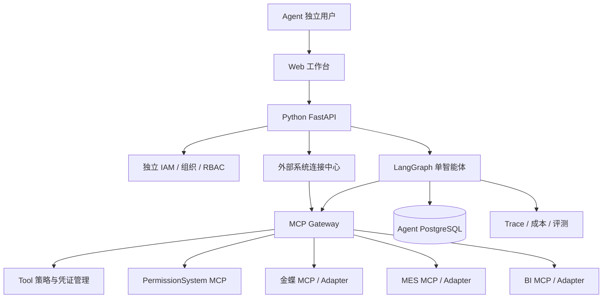
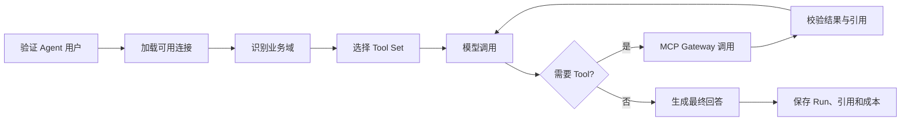

# 企业级 AI 智能体平台实施方案

## 1. 文档信息

| 项目 | 内容 |
| --- | --- |
| 文档状态 | 已确认，按可用产品优先执行 |
| 项目目录 | `E:\Projects\AiAgent` |
| 核心语言 | Python 3.12 |
| 首期形态 | 独立认证体系、单智能体、只读 MCP Tool |
| 当前目标 | 先交付可供真实用户试用的 Web 工作台和 PermissionSystem 查询闭环 |
| 演进方向 | 可用产品闭环稳定后，再迭代多业务系统和企业治理能力 |
| 当前实施状态 | 后端 P0-P3、P5 基础已完成；当前转入 U1-U6 可用性优先阶段 |

## 2. 项目定位

建设一个独立的企业级 AI 智能体平台。平台拥有自己的用户、组织、登录、权限、会话、模型和 Agent 管理体系，与 PermissionSystem、金蝶、MES、BI 等业务系统的用户认证体系保持隔离。

业务系统只作为业务数据和业务能力的权威来源，通过 MCP Server 对外提供经过认证、授权、限流和审计的 Tool。智能体平台不直接访问业务系统数据库，不依赖业务系统内部技术栈，也不通过业务 REST API 获取业务数据。

整体交互模式参考独立智能体产品：用户先登录智能体平台，再按需连接自己的业务系统账号，连接可以授权、刷新、撤销和断开。

## 3. 建设目标

### 3.1 首期目标

- 先提供用户可以直接操作的 Web 工作台，不再以 OpenAPI 和 CLI 作为主要使用入口。
- 打通“登录、连接 PermissionSystem、对话查询、查看来源、查看历史、提交反馈”的完整路径。
- 建立独立的用户、组织和 Agent RBAC 体系。
- 提供对话、历史记录、流式响应、运行取消和用户反馈。
- 建立外部系统连接中心，支持个人连接和组织共享连接。
- 通过 MCP Streamable HTTP 发现并调用业务系统 Tool。
- 首先完成 PermissionSystem 普通员工个人授权和只读查询闭环。
- 对所有业务事实提供可追溯来源、查询时间和 TraceId。
- 建立模型调用、Tool 调用、费用、延迟和错误审计。
- 为金蝶、MES、BI MCP Server 或 MCP Adapter 预留统一接入方式。
- 保持单智能体实现边界，为后续多智能体演进预留接口。

### 3.2 首期非目标

- 不建设多智能体协作。
- 不开放创建、修改、删除、审批等业务写操作。
- 不允许模型生成并执行任意 SQL、脚本或 HTTP 请求。
- 不直接访问 PermissionSystem、金蝶、MES 或 BI 数据库。
- 不复制业务系统的用户权限和业务数据。
- 不使用手机号作为业务系统调用者的身份凭据。
- 不同时完成所有业务系统接入。
- 不引入知识库、向量数据库和 RAG；有明确文档问答需求后再建设。

### 3.3 当前实施原则

1. **可用性优先**：优先实现用户能够感知和操作的完整流程，不以补齐全部底层治理能力作为试用前置条件。
2. **单场景闭环**：首个可用版本只围绕 PermissionSystem 个人连接和只读查询，不并行接入金蝶、MES 和 BI。
3. **最小管理能力**：管理员首期只需维护默认 Agent 的草稿、版本、发布和回滚，不建设完整运营后台。
4. **按需补后端**：现有 API 能满足页面时直接复用；只有真实用户流程被阻塞时才新增后端能力。
5. **保留安全底线**：认证、组织隔离、RBAC、凭证保护、MCP 可信注册、参数校验和审计不得延后或绕过。
6. **复杂治理后置**：生产强制评测门禁、多模型治理、SCIM、SIEM、长期记忆和 FinOps 在可用版本稳定后迭代。

## 4. 核心架构原则

1. **认证隔离**：智能体用户身份由智能体平台管理，业务系统不参与智能体登录。
2. **账号连接**：智能体用户与业务系统用户通过可撤销的外部账号连接关联。
3. **MCP-only**：智能体业务数据访问统一经过 MCP，不直接调用业务 API 或数据库。
4. **权限下沉**：业务权限和数据范围尽量由目标业务系统最终校验。
5. **最小权限**：每个连接只获得完成目标任务所需的最小 Scope、Tool 和数据范围。
6. **确定性安全**：身份、权限、限流、参数校验和审批不得依赖提示词或模型判断。
7. **结构化契约**：Tool 使用严格的输入输出 Schema、版本、超时和错误模型。
8. **全链路审计**：用户、Agent、连接、模型、Tool、来源和结果通过 TraceId 关联。
9. **业务数据不落库**：智能体默认只保存调用摘要和引用，不复制业务明细。
10. **渐进演进**：先完成单智能体和一个真实系统闭环，再扩展系统和编排能力。

## 5. 总体架构



## 6. 组件职责

### 6.1 Web 工作台

- 用户登录和退出。
- 新建、切换和恢复历史对话。
- 消息、运行状态、流式回答、停止生成和错误恢复。
- 外部系统连接、断开和授权状态展示。
- 引用来源、权限拒绝、错误和不完整结果展示。
- 点赞、点踩和可选反馈说明。
- 默认 Agent 的最小管理入口。

首个可用版本不包含审批中心、成员与角色管理、配额看板、安全策略中心和复杂运营仪表盘；这些能力在真实使用反馈明确后再建设。

### 6.2 Agent API

- 提供用户、组织、会话、运行和连接 API。
- 验证智能体平台用户身份和平台权限。
- 创建统一 `RunContext` 并启动 Agent 运行。
- 使用 SSE 返回回答和运行事件。
- 处理取消、超时、重试和幂等。

### 6.3 Agent 编排层

- 理解用户问题并判断业务域。
- 按用户连接和权限选择相关 Tool Set。
- 控制模型轮次、Tool 次数、运行时间和费用。
- 调用 MCP Gateway，不直接管理业务凭证。
- 校验 Tool 结果并生成带来源回答。
- 没有 MCP 证据时不输出可验证业务事实。

### 6.4 外部系统连接中心

- 管理个人连接和组织共享连接。
- 发起 OAuth Authorization Code + PKCE 流程。
- 校验 `state`、`nonce`、回调地址和授权结果。
- 保存目标系统稳定用户标识、授权 Scope 和凭证引用。
- 刷新、撤销、失效和断开外部连接。
- 不向模型、浏览器日志或普通应用日志暴露 Token。

### 6.5 MCP Gateway

- 管理可信 MCP Server 注册信息。
- 根据用户和连接加载 MCP Tool Catalog。
- 为调用选择正确的个人或组织凭证。
- 注入身份上下文、TraceId、超时和取消信号。
- 统一执行参数校验、限流、熔断和错误映射。
- 对 Tool 响应执行 Schema、大小和敏感信息检查。
- 记录调用摘要、耗时、状态、来源和引用。

### 6.6 MCP Server 与 Adapter

- 原生支持 MCP 的系统由 Agent MCP Gateway 直接连接。
- 不支持 MCP 的系统通过独立 Adapter 包装其官方 API。
- Adapter 对 Agent 只暴露 MCP，不暴露目标系统 API 细节。
- 每个 Adapter 独立保存和使用目标系统凭证，避免跨系统共享。
- Adapter 不允许任意 URL、任意 SQL、任意表或任意脚本能力。

## 7. 技术选型

| 模块 | 选型 | 说明 |
| --- | --- | --- |
| 后端语言 | Python 3.12 | AI 与 Web 生态稳定，兼容性较好 |
| 依赖管理 | uv + `pyproject.toml` | 依赖锁定、环境和 CI 管理 |
| API | FastAPI + Uvicorn | 异步 API、类型校验和 SSE |
| 数据模型 | Pydantic v2 | API、配置、Tool 和运行上下文校验 |
| Agent 编排 | LangGraph | 首期单 Agent，后续可拆分 Subgraph |
| MCP | 官方 MCP Python SDK | Streamable HTTP Client |
| 模型接入 | 自定义 `ModelProvider` 接口 | 首期接入一个模型供应商，避免业务层绑定 |
| Agent 身份 | 独立 OIDC | 默认建议专用 Keycloak Realm，可替换企业 IdP |
| ORM | SQLAlchemy 2 | 异步持久化和清晰的数据访问边界 |
| 数据迁移 | Alembic | 版本化数据库变更 |
| 主数据库 | PostgreSQL | 用户、连接、会话、运行和审计数据 |
| 缓存 | Redis | 限流、短期状态和 Tool Catalog 缓存 |
| 密钥管理 | `CredentialVault` 抽象 | 开发使用安全本地配置，生产接 Vault/KMS |
| 可观测性 | OpenTelemetry + Langfuse + Prometheus | Trace、模型、Tool、成本和运行指标 |
| 测试 | pytest + pytest-asyncio + respx + Testcontainers | 单元、集成、契约和真实依赖测试 |
| 代码质量 | Ruff + mypy + pre-commit | 格式、静态检查和提交前检查 |
| 前端 | Vue 3 + TypeScript | 独立的聊天和连接管理工作台 |
| 部署 | Docker Compose | 首期部署；达到扩缩容要求后再评估 Kubernetes |

## 8. 身份与连接模型

### 8.1 三类身份

1. **Agent 用户身份**：用户登录智能体平台的独立身份。
2. **外部账号身份**：该用户在某个业务系统中的身份。
3. **MCP 调用凭证**：调用某个 MCP Server 时使用的短期 Token 或服务凭证。

三类身份不得混用。模型只能接触业务参数，不能访问或决定身份凭证。

### 8.2 个人连接

```text
Agent 用户登录
    -> 点击连接业务系统
    -> 跳转目标系统 OAuth 授权页
    -> 用户登录目标系统并确认授权
    -> Agent 接收 OAuth 回调
    -> 保存 external subject、scope 和 credential reference
    -> 使用用户 Token 调用目标 MCP Server
    -> 目标系统按该用户权限和数据范围执行 Tool
```

个人连接适用于支持 OAuth 用户授权、OBO 或等价用户委托能力的业务系统。

### 8.3 组织共享连接

组织管理员使用 Client Credentials、API Key 或证书创建连接，并为连接配置可使用的组织、账套、工厂、产线、Workspace、Tool 和字段范围。

组织共享连接不代表目标系统用户身份，不能声称严格继承某个员工的业务权限。该连接只允许开放审核过的最小只读能力。

### 8.4 手机号的使用边界

- 手机号可以用于首次账号匹配和人工核验。
- 手机号不能作为运行时调用者身份。
- 手机号不能由模型作为身份参数传递给 Tool。
- 外部账号关联使用目标系统返回的稳定 `issuer + subject`。
- 若确需手机号辅助绑定，必须验证、处理冲突、记录审计并支持变更解绑。

## 9. 权限模型

最终有效权限采用交集计算：

```text
最终权限 =
Agent 平台 Tool 使用权限
∩ 用户已建立的外部连接
∩ 外部授权 Scope
∩ MCP Server Tool 权限
∩ 目标系统用户权限和数据范围
∩ 当前操作风险策略
```

Agent 平台建议提供以下权限：

- `agent:use`
- `connection:personal:create`
- `connection:personal:disconnect`
- `connection:organization:manage`
- `mcp-server:view`
- `mcp-server:manage`
- `tool:permission:use`
- `tool:erp:use`
- `tool:mes:use`
- `tool:bi:use`
- `agent:manage`
- `audit:view`
- `action:approve`，首期预留但不开放业务写操作

Agent 平台权限只决定用户能否使用某类 Agent、连接和 Tool，不复制目标系统内部角色和权限矩阵。

## 10. MCP Server 接入模型

### 10.1 MCP Server 注册

只有 Agent 组织管理员或平台管理员可以注册 MCP Server。注册信息至少包括：

- Server Code、显示名称和所属系统。
- MCP URL 和允许的传输方式。
- 授权服务器和支持的认证模式。
- 允许的 Tool 名称或 Tool Set。
- 数据分级、风险等级和连接所有权类型。
- TLS、证书、网络区域和可信状态。
- 超时、并发、限流、重试和熔断配置。
- 启用状态和配置版本。

用户不能输入任意 URL 并直接连接，避免 SSRF 和恶意 MCP Server。

### 10.2 Tool Catalog

- Tool Catalog 按 MCP Server、连接、用户和 Scope 加载。
- 缓存键必须包含 Server、连接、用户、组织和授权摘要，禁止跨用户共用。
- Tool 定义包含稳定名称、版本、输入 Schema、输出 Schema、风险和超时。
- Tool 接近 20 个时按业务域和 Tool Set 筛选，每轮模型只接收 5 至 15 个相关 Tool。
- Tool Schema 或授权变化时使旧缓存失效，并采用 fail-closed 行为。

### 10.3 Tool 命名

建议使用系统前缀避免冲突：

```text
permission.search_users
permission.explain_effective_access
kingdee.get_sales_order
kingdee.query_inventory_balance
mes.get_work_order_status
mes.query_production_progress
bi.query_metric
bi.get_dashboard_snapshot
```

实际名称以业务系统正式契约为准，不根据数据库表或 CRUD 接口自动生成。

## 11. Agent 编排设计

### 11.1 单次运行流程



### 11.2 初始运行限制

- 用户问题最大 4,000 字符。
- 模型调用最多 6 轮。
- Tool 调用最多 10 次。
- 单次运行最长 90 秒。
- 单 Tool 设置独立超时。
- 输入 Token、输出 Token 和费用设置硬上限。
- Tool 返回设置行数和响应大小上限。
- 只对幂等读操作执行有限重试。

以上为初始技术默认值，进入生产前根据业务场景和压测结果调整。

### 11.3 回答与引用

每个业务事实引用至少包含：

- 来源系统。
- MCP Server 和 Tool 名称。
- 数据集或资源标识及版本。
- 查询时间。
- TraceId。
- 是否截断或部分失败。

没有 Tool 证据时必须明确说明无法验证。结果被截断时不能描述为全量结果；部分系统失败时不能生成完整性结论。

## 12. 多智能体演进

首期保持单智能体，但所有 Agent 通过统一接口工作：

```python
class RunContext:
    organization_id: str
    user_id: str
    trace_id: str
    deadline: datetime
    token_budget: int


class ToolGateway:
    async def list_tools(
        self,
        context: RunContext,
        tool_set: str,
    ) -> list[ToolDefinition]: ...

    async def call(
        self,
        context: RunContext,
        tool_name: str,
        arguments: dict,
    ) -> ToolResult: ...


class AgentResult:
    answer: str
    citations: list[Citation]
    status: str
```

后续可按以下顺序演进：

1. 单 Agent 按业务域选择 Tool Set。
2. 将权限、ERP、MES、BI 逻辑拆成 LangGraph Subgraph。
3. 增加 Supervisor，委派给领域 Agent。
4. 只有无依赖任务才并行执行。
5. 高频跨系统流程优先封装为确定性组合 Tool。
6. 达到独立扩缩容、故障隔离或团队边界要求后，再拆成独立服务。

认证、外部连接、MCP Gateway、Tool Catalog、权限和审计不会随着 Agent 数量增加而重复建设。

## 13. 数据模型

### 13.1 身份与组织

- `User`
- `Organization`
- `OrganizationMember`
- `Role`
- `Permission`
- `RolePermission`
- `MemberRole`

### 13.2 MCP 与外部连接

- `McpServerDefinition`
- `ExternalConnection`
- `ExternalAuthorizationGrant`
- `ConnectionToolGrant`
- `CredentialReference`

### 13.3 Agent 与运行

- `AgentDefinition`
- `AgentVersion`
- `AgentToolSet`
- `Conversation`
- `Message`
- `Run`
- `RunStep`
- `ToolInvocation`
- `Citation`
- `ModelUsage`
- `UserFeedback`
- `AuditLog`

### 13.4 持久化约束

- 所有用户数据绑定 `OrganizationId` 和 `UserId`。
- 外部连接明确标记个人或组织所有权。
- Token、Refresh Token、Client Secret 和证书私钥不明文入库。
- 审计表采用追加写模式，普通用户不能修改。
- 业务数据默认不持久化，只记录摘要、Digest 和引用。
- 敏感 Tool 结果不得写入普通日志。
- 删除用户或断开连接时必须执行凭证撤销和保留策略。

## 14. 建议代码结构

```text
AiAgent/
  apps/
    api/                         # FastAPI 入口
    web/                         # Vue 工作台
  src/ai_agent/
    identity/                    # 独立用户和组织
    authorization/               # Agent RBAC
    connections/                 # 外部账号连接
    credentials/                 # Token 与 Vault
    models/                      # 模型适配
    agents/                      # LangGraph 与 Agent 定义
    mcp/
      registry.py                # MCP Server 注册
      connection_manager.py      # MCP 会话与凭证选择
      tool_catalog.py            # Tool 发现与筛选
      gateway.py                 # 统一 Tool 调用
    conversations/
    runs/
    audit/
    observability/
    infrastructure/
  adapters/
    kingdee_mcp/
    mes_mcp/
    bi_mcp/
  tests/
    unit/
    integration/
    contract/
    evals/
  docs/
```

首期采用模块化单体。MCP Adapter 独立进程或容器部署，避免将目标系统 SDK 和凭证加载进 Agent API 进程。

## 15. PermissionSystem 首个接入方案

PermissionSystem 当前已有独立 MCP Server、Streamable HTTP、OpenIddict Token 验证、委托用户身份、服务客户端、Tool、数据集授权、字段授权和调用审计能力。

首期采用个人连接：

1. 在 PermissionSystem 注册 Agent 平台 OAuth Client。
2. 配置 Agent 回调地址和 Authorization Code + PKCE。
3. Agent 用户点击连接 PermissionSystem。
4. 用户使用自己的 PermissionSystem 账号授权。
5. Agent 保存用户外部 Subject 和凭证引用。
6. Agent 使用用户 Token 调用 PermissionSystem `/mcp`。
7. PermissionSystem 继续校验租户、会话、权限和数据范围。
8. Agent 保存 Tool 调用引用，不保存 PermissionSystem 业务明细。

Agent 不调用 PermissionSystem `/api/ai/*`，不复用其 AI 会话、运行、模型和成本表，也不直接访问其数据库。

PermissionSystem 需要完成的最小配合：

- 注册 Agent OAuth Client 和回调地址。
- 确认 `permission-system-mcp` Scope 的用户授权流程。
- 完成 Token 刷新、撤销、退出和权限失效测试。
- 完成真实 Agent MCP Client 的协议和生产等价环境联调。
- 后续根据业务需求扩展受控只读 Tool，不开放任意 SQL。

## 16. 其他业务系统接入

### 16.1 原生 MCP 系统

直接注册 MCP Server，通过个人 OAuth 或组织服务凭证连接。

### 16.2 不支持 MCP 的系统

新增独立 MCP Adapter：

```text
Agent MCP Gateway
    -> MCP Adapter
        -> 目标系统官方 API/SDK
```

Adapter 负责：

- 目标系统认证和凭证刷新。
- 用户、租户、组织、账套、工厂、产线或 Workspace 映射。
- Tool 输入输出和业务错误转换。
- 字段裁剪、数据分级和脱敏。
- 超时、限流、熔断和审计。

### 16.3 推荐接入顺序

1. PermissionSystem：验证普通员工个人授权和业务权限闭环。
2. 金蝶：优先订单或库存的 2 至 3 个只读 Tool。
3. MES：优先工单状态或生产进度的 2 至 3 个只读 Tool。
4. BI：优先正式语义指标查询，不直接导出大批原始数据。

每个系统接入前必须确认实际版本、认证模式、官方 API、用户唯一标识、组织范围和业务 Owner，不能根据通用经验虚构接口。

## 17. API 初步规划

### 17.1 用户与组织

- `GET /api/v1/me`
- `GET /api/v1/organizations/current`
- `GET /api/v1/organizations/current/members`
- `PUT /api/v1/organizations/current/members/{id}/roles`

### 17.2 外部连接

- `GET /api/v1/connections`
- `POST /api/v1/connections/{server_code}/authorize`
- `GET /api/v1/connections/{server_code}/callback`
- `DELETE /api/v1/connections/{id}`
- `POST /api/v1/organization-connections`

### 17.3 对话与运行

- `GET /api/v1/conversations`
- `POST /api/v1/conversations`
- `GET /api/v1/conversations/{id}`
- `POST /api/v1/conversations/{id}/messages`
- `GET /api/v1/runs/{id}/events`
- `POST /api/v1/runs/{id}/cancel`
- `POST /api/v1/runs/{id}/feedback`

### 17.4 管理端

- `GET /api/v1/admin/mcp-servers`
- `POST /api/v1/admin/mcp-servers`
- `PUT /api/v1/admin/mcp-servers/{id}`
- `GET /api/v1/admin/agents`
- `PUT /api/v1/admin/agents/{id}`
- `GET /api/v1/admin/audit-logs`

正式实现前应补充 OpenAPI 契约、分页、错误码、幂等和权限标注。

## 18. 安全基线

- Agent 登录和外部连接使用 Authorization Code + PKCE。
- OAuth 回调严格校验 `state`、`nonce`、Issuer、Audience 和 Redirect URI。
- Token 和 Secret 只进入凭证管理层，不进入 Prompt、Tool 参数和日志。
- MCP Server 地址仅允许管理员注册并通过协议、TLS、DNS/IP 和 SSRF 校验。
- 每个 MCP Server、连接和 Tool 设置独立限流、超时和熔断。
- Tool 输入和输出必须通过 JSON Schema/Pydantic 校验。
- Tool 返回内容视为不可信输入，不能修改系统提示或绕过权限。
- 个人连接缓存按组织、Agent 用户、外部连接和 Scope 隔离。
- 写操作首期禁用；后续必须采用草稿、校验、预览、审批、幂等提交和审计。
- 管理操作、连接变化、授权失败和 Tool 调用必须审计。
- 日志不得记录完整 Token、Secret、密码、Cookie、手机号或敏感业务明细。

## 19. 可观测性与运营

### 19.1 Trace

一次运行使用统一 TraceId，关联：

- Agent API 请求。
- 模型调用。
- MCP Server 和 Tool 调用。
- Adapter 和目标系统调用。
- 最终回答与引用。

### 19.2 指标

- Run 成功率、失败率、取消率和超时率。
- Run P50、P95、P99 延迟。
- 模型输入/输出 Token 和费用。
- Tool 成功率、拒绝率、超时率和 P95。
- MCP Server 可用性、连接失败和 Token 刷新失败。
- 用户反馈和无依据拒答率。

### 19.3 告警

- 模型或 MCP Server 连续失败。
- OAuth Token 刷新异常。
- Tool 拒绝率或超时率持续升高。
- 单用户、组织或模型费用超限。
- 组织共享连接异常调用。
- 敏感数据或异常输出检测命中。

## 20. 测试策略

### 20.1 单元测试

- 身份和组织权限。
- 外部连接状态机。
- OAuth 回调和 Token 刷新。
- Tool Catalog 筛选和缓存隔离。
- MCP 参数、结果和错误映射。
- Agent 轮次、次数、超时和费用限制。
- 引用生成和截断处理。

### 20.2 契约测试

- MCP `initialize`、`tools/list` 和 `tools/call`。
- Protected Resource Metadata 和授权发现。
- Tool 输入输出 Schema。
- Token 过期、撤销和权限变化。
- MCP Server 或 Adapter 版本兼容。

### 20.3 集成测试

- PostgreSQL、Redis、OIDC 和凭证存储。
- 用户登录、连接、调用、断开完整流程。
- 不同用户和组织之间的数据隔离。
- PermissionSystem 真实 Token 到 MCP 调用链路。
- MCP 超时、限流、熔断和部分失败。

### 20.4 Agent 评测

- 为首批场景建立黄金问题集。
- 评测 Tool 选择、参数准确性、业务事实正确性和引用覆盖率。
- 测试提示注入、越权请求、无数据问题和冲突结果。
- Prompt、模型或 Tool Schema 变化后执行回归评测。

## 21. MVP 验收标准

- 用户可以通过 Web 页面登录和退出，不依赖业务系统登录状态。
- 用户可以在页面中连接、查看状态和断开自己的 PermissionSystem 账号。
- 用户可以新建对话、连续提问并实时看到流式回答。
- 用户可以停止运行；刷新页面后能够恢复会话和最终运行状态。
- 用户可以查看历史对话、业务引用和不完整结果说明。
- 用户可以对回答点赞、点踩并提交可选说明。
- 管理员可以维护默认 Agent 的草稿、版本、发布和回滚。
- 不同 Agent 用户的外部连接和 Tool Catalog 不会互相复用。
- PermissionSystem 根据被连接用户的真实权限执行 Tool。
- Agent 只能通过 MCP 获取业务数据。
- 未连接系统、无权限 Tool 和越权数据请求均明确拒绝。
- 所有业务事实回答具有来源和 TraceId。
- Tool 返回截断或部分失败时，回答正确表达限制。
- Token、Secret 和敏感数据不进入模型日志及普通日志。
- 模型轮次、Tool 次数、运行时间和费用均有硬上限。
- 聊天、连接和引用主路径具有自动化测试，并完成至少一轮真实员工账号验收。
- 服务保留已有健康检查、基础指标、审计和关闭开关；更深的治理能力不作为内部试用前置条件。

## 22. 分阶段实施计划

### 22.1 已有技术基线

历史 P0-P3 和 P5 已提供 Python/FastAPI 工程、OIDC、RBAC、PostgreSQL/Redis、会话、Run、SSE、模型调用、MCP Gateway、PermissionSystem 连接、引用、审计和基础生产治理。P4 多系统扩展按原决策跳过。

这些能力作为当前可用产品阶段的后端基础保留，不再继续横向扩建底层能力。

### U1：Web 工作台骨架和登录

- 新建 Vue 3 + TypeScript 前端工程，建立路由、布局、API Client 和统一错误处理。
- 完成登录跳转、回调后的会话恢复、当前用户信息和安全退出。
- 建立对话工作台、连接中心和最小管理入口的页面骨架。

退出条件：用户可以从浏览器完成登录并进入工作台，刷新后会话仍然有效。

### U2：对话和流式交互

- 完成会话列表、新建会话、消息展示和问题发送。
- 接入 Run SSE，展示排队、生成、工具调用、完成、失败和取消状态。
- 支持停止生成、页面刷新后的状态恢复，以及未连接、无权限、超时等用户可理解的错误提示。

退出条件：用户可以稳定完成一次纯模型或 MCP Agent 对话，并能停止和恢复查看结果。

### U3：PermissionSystem 真实业务闭环

- 完成连接状态、OAuth 授权、回调结果、断开和重新连接页面。
- 首批只覆盖 3 至 5 个已确认的 PermissionSystem 只读问题。
- 从聊天错误直接引导用户建立或修复连接。
- 使用真实员工账号验证权限范围、权限拒绝和 Token 撤销。

退出条件：真实员工可以用自己的业务权限完成一次带来源的 PermissionSystem 查询。

### U4：历史、引用和轻量反馈

- 完成历史对话恢复、引用来源卡片、复制回答和不完整结果提示。
- 增加点赞、点踩、反馈分类和可选说明。
- 首期只保存和查询反馈，不建设 Issue、SLA、自动工单和反馈转评测集。

退出条件：用户能够复查结果、理解来源并反馈问题，产品团队可以按组织查看基础反馈。

### U5：默认 Agent 最小管理

- 提供 Agent 列表、基本信息、系统提示词、允许 Tool 和运行限制编辑。
- 支持保存草稿、创建版本、发布当前环境、查看生效版本和回滚。
- EvalOps 继续使用关闭或提示模式，不把生产强制门禁作为试用前置条件。

退出条件：管理员无需修改环境变量或调用 OpenAPI，即可调整并发布默认 Agent。

### U6：体验收口和内部试用

- 补齐空状态、加载状态、错误恢复、桌面端布局和基础可访问性。
- 建立登录、连接、对话、停止、引用和反馈的端到端冒烟测试。
- 选择少量真实用户完成试用，按阻断程度修复问题。

退出条件：满足第 21 节 MVP 验收标准，并形成明确的试用反馈清单。

### 22.2 延后实施能力

以下能力不删除现有基础，但在 U1-U6 完成前不继续扩展：

- 独立 Eval Worker、基线比较、结果导出和生产强制发布门禁。
- SCIM、完整数据生命周期、SIEM 外送和不可变外部审计。
- 多模型路由、自动故障转移、长期记忆和完整 FinOps。
- 完整 DLP、审批中心、安全策略运营台和复杂可观测性体系。
- 金蝶、MES、BI、多智能体、通用工作流和 Kubernetes/微服务改造。

若真实用户流程被其中某项直接阻塞，可单独评审后提前最小切片，不默认恢复整项建设。

## 23. 风险清单

| 风险 | 等级 | 应对措施 |
| --- | --- | --- |
| 外部 Token 或 Secret 泄漏 | 高 | Vault/KMS、加密、最小权限、轮换和日志脱敏 |
| 跨用户连接或缓存污染 | 高 | 缓存键强制包含组织、用户、连接和 Scope |
| 组织连接权限过宽 | 高 | 只读账号、Tool/字段/组织范围白名单和管理员审核 |
| 恶意 MCP Server 或 SSRF | 高 | 管理员注册、地址白名单、TLS、DNS/IP 和出站网络控制 |
| Tool 返回提示注入 | 高 | 返回视为不可信数据，隔离指令与事实并执行输出校验 |
| 业务系统不支持用户委托 | 高 | 明确标记组织连接，不虚假承诺个人权限继承 |
| 跨系统主数据映射错误 | 高 | 确定性映射服务、业务 Owner 和冲突时拒绝 |
| 模型幻觉 | 高 | 结构化 Tool、引用、无依据拒答和黄金评测 |
| Tool 数量过多导致选择下降 | 中 | 业务域路由和每轮 5 至 15 个 Tool |
| 外部系统不稳定 | 中 | 超时、熔断、部分结果和系统级告警 |
| 成本失控 | 中 | Token、Tool、运行、用户和组织级硬限额 |
| 多智能体过早引入复杂度 | 中 | 首期单 Agent，达到明确触发条件后再拆分 |

## 24. 数据库评审

[DBA]

- AiAgent 使用独立 PostgreSQL，不与业务系统共享数据库。
- 首期 PermissionSystem 只需 OAuth Client 配置和 MCP 联调，原则上无业务数据库结构变更。
- AiAgent 数据库只保存平台身份、连接元数据、凭证引用、会话、运行、引用和审计。
- 不复制业务系统明细数据，不将 Token、Secret 或证书私钥明文持久化。
- 正式建模时需要进一步确认软删除、审计留存、并发控制、组织隔离和凭证删除策略。

## 25. 实施评审

[Developer]

- 按 U1 至 U6 顺序实施，优先形成用户可操作的端到端闭环。
- 每个阶段只补充阻塞当前用户流程的最小后端能力，不主动扩建底层平台。
- 优先建立接口和契约，不将系统连接、权限和凭证逻辑写入 Agent Prompt。
- 首个端到端能力固定使用 PermissionSystem 个人连接和只读 MCP Tool。
- 新增业务系统前必须取得正式 API/MCP 文档、测试环境和业务 Owner 确认。

[Reviewer]

- 方案架构方向通过，但生产上线取决于 OAuth、连接隔离、MCP 授权、SSRF、凭证和业务权限的完整验收。
- 任何无法说明“调用者是谁、凭证属于谁、权限在哪里校验”的连接不得向普通员工开放。
- 任何组织共享连接不得冒充个人权限，也不得通过手机号或模型参数切换调用者身份。
- 任何业务事实缺少 MCP 来源时不得作为确定结论输出。

## 26. 待确认事项

以下事项不阻塞 U1 和 U2，可在进入对应阶段前确认：

1. 独立认证默认使用专用 Keycloak Realm，还是接入现有企业统一身份平台。
2. 首期模型供应商、数据驻留要求、允许发送的数据分级和费用预算。
3. 前端默认采用 Vue 3 + TypeScript；如需接入既有企业前端工程，应在 U1 开始前调整。
4. 首个 PermissionSystem 业务场景及对应只读 Tool 清单。
5. 用户、组织、会话、运行和审计数据的保留周期。
6. MVP 目标并发、可用性和 P95 响应时间。
7. 金蝶、MES、BI 的实际版本、认证方式、API/MCP 文档和测试环境。

以上事项确认后，再进入 P0 工程初始化和协议验证。
